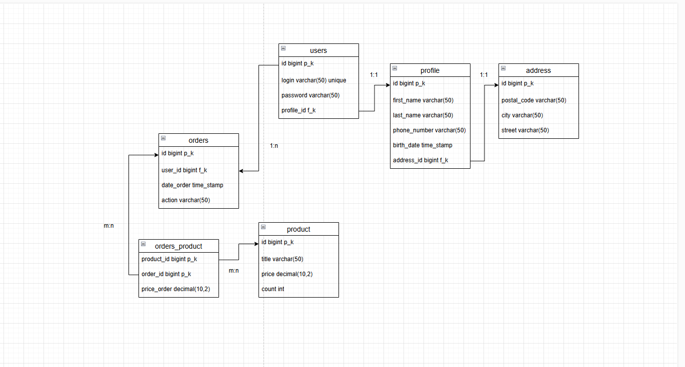

* `users:` 

`id` - индефицирует каждого студента _первичный ключ_

`login` - индивидуальное поле

`password` - есть у каждого пользователя, также использует для входа

`profile` - _внешний ключ_, ссылается на новую таблицу, где подробно расписаны личные данные пользователя (2 н.ф). Связь 1:1

* `profile:` 

`id` - _первичный ключ_, индефицирует каждую запись

`first_name` - имя пользователя

`last_name` - фамилия пользователя

`phone_number` - номер телефона пользователя

`date_birth` - дата рождения пользователя 

`address_id` - _внешний ключ_, который ссылает на таблицу address (у каждого пользователя индивидуальный адрес). Связь 1:1

* `address:`

`id` - индефицирует каждую запись в таблице _первичный ключ_

`postal_code` - индивидуальный почтовый индекс адреса

`city` - город

`street` - улица

* `products:`

`id` - индефицирует каждую запись, первчиный ключ

`title` - название продукта

`price` - цена

`count` - кол-во 

* `orders:` 

`id` - первичный ключ, индефицирует запись в таблице

`user_id` - внешний ключ, ссылается на таблицу users (связь 1:n значит что у пользователя может быть много заказов)

`date_order` - время заказа

`action` - статус заказа

* `orders_product:`

`product_id` - первычиный ключ / внешний ключ

`order_id` - первичный ключ / внешний ключ

`price_order` - цена всего заказа

**_составной ключ_** (product_id, order_id - значит что он уникальный и такого в таблице быть не может (допустим есть запись 1.1 значит повторной записи 1.1 больше не будет))

**_связь m:n_** у заказа может быть много продуктов и наоборот продуктов могут быть в много заказов

