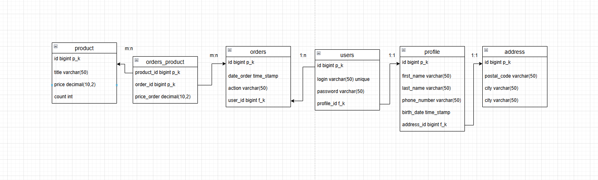

* `users:` 

`id` - первичный ключ, индефицирует запись

`login` - логин пользователя

`password` - пароль пользователя

`profile_id` - внешний ключ, ссылается на profile у каждого пользователя есть профиль 1:1

* `profile:` 

`id` - первичный ключ, индефицирует запись

`first_name` - имя пользователя

`last_name` - фамилия пользователя

`phone_number` - номер телефона пользователя

`date_birth` - дата рождения пользователя 

`address_id` - внешний ключ, ссылается на address у каждого пользователя есть адрес 1:1

* `address:`

`id` - первичный ключ, индефицирует запись

`postal_code` - индивидуальный почтовый индекс адреса

`city` - город

`street` - улица

* `products:`

`id` - первичный ключ, индефицирует запись

`title` - название продукта

`price` - цена

`count` - кол-во 

* `orders:` 

`id` - первичный ключ, индефицирует запись

`date_order` - время заказа

`action` - статус заказа

`user_id` - внешний ключ, ссылается на таблицу users, у каждого пользователя может быть нескольок заказов

* `orders_product:`

`product_id` - внешний ключ, ссылается на product

`order_id` - нешний ключ, ссылается на orders

`price_order` - цена всего заказа

`Cвязь m:n` у заказа может быть много продуктов и продукт может находиться в нескольких заказах

