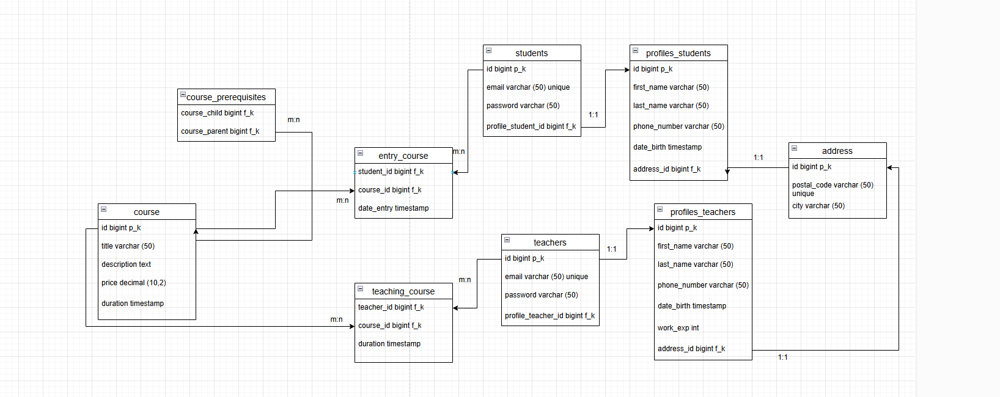

* `students`: 

`id` - первичный ключ, индефицирует запись

`email` - почта студента, уникальная

`password` - пароль пользователя

`profile_student` - внешний ключ, ссылается на profiles_students, у каждого пользователя свой профиль 1:1

* `profile_students:`

`id` - первичный ключ, индефицирует запись

`first_name` - имя студента

`last_name` - фамилия студента

`phone_number` - номер телефона студента

`date_birth` - дата рождения студента 

`address_id` - внешний ключ, ссылается на address, у каждого пользователя свой адрес 1:1

* `address:`

`id` - первичный ключ, индефицирует запись

`postal_code` - индивидуальный почтовый индекс адреса

`city` - город 

`teachers:`

`id` - первичный ключ, индефицирует запись

`email` - почта учителя, уникальная

`password` - пароль учителя

`teacher_profile_id` - внешний ключ, ссылается на profiles_teachers, у каждого учителя свой профиль 1:1

* `profile_teachers:`

`id` - первичный ключ, индефицирует запись

`first_name` - имя учителя

`last_name` - фамилия учителя

`phone_number` - номер телефона учителя

`date_birth` - дата рождения учителя

`work_exp` - стаж работы учителя

`address_id` - внешний ключ, ссылается на address, у каждого учителя свой адрес 1:1

* `courses:`

`id` - первичный ключ, индефицирует запись

`title` - название курса

`description` - описание курса

`price` - цена курса

`duration_course` - длительность курса

* `entry_course:` 

`student_id` - внешний ключ, ссылается на students

`course_id` - внешний ключ, ссылается на coursers

`date_entry` - время записи на курс

`Связь m:n` на курсе может быть много студентов и студент может входить в несколько курсов 

* `teaching_course` 

`teacher_id` - внешний ключ, ссылается на teachers

`course_id` - внешний ключ, ссылается на coursers

`duration` - время курса, которое будет вести препод

`Связь m:n` учитель может вести много курсов так и у курса может быть много учителей

* `course_prerequisites`

`course_child` - внешний ключ, ссылается на таблицу courses 

`course_parent` - внешний ключ, который ссылается на таблицу courses 

`Связь m:n` у курса предшественника может быть много родителских курсов так и наоборот и родительского курса может быть много курсов предшетсвенников

