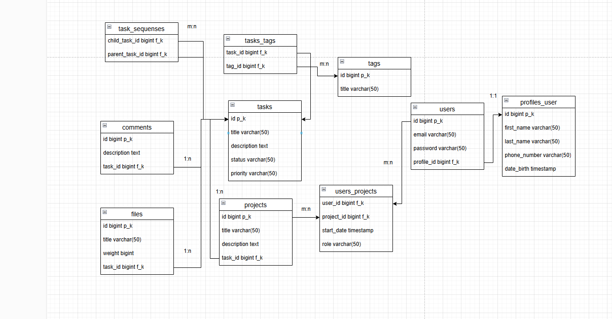

* `users:` 

`id` - первичный ключ, индефицирует запись

`email` - почта пользователя

`password` - пароль позьзователя

`profile_id` - внешний ключ для связи с profiles_user

* `profiles_user`

`id` - первичный ключ, индефицирует запись

`first_name` - имя пользователя

`last_name` - фамилия пользователя

`phone_number` - телефон пользователя

`date_birth` - дата рождения пользователя

* `projects:`

`id` - первичный ключ, индефицирует запись

`title` - название проекта

`description` - описание проекта 

`task_id` - внешний ключ, использвуется для связи, у проекта может быть несколько задач 1:n

* `users_projects:`

`user_id` - внешний ключ, ссылается на users

`project_id` - внешний ключ, ссылается на projects

`start_date` - начальная дата проекта у пользователя

`role` - роль позьвателя в проекте

`Связь m:n` у проекта может быть нескольок пользователей и у пользователь можете быть включен в нескольок проектов

* `tasks:`

`id` - первичный ключ, индефицирует запись

`title` - название задачи

`description` - описание задачи

`status` - статус задачи 

`priority` - приоритет задачи

* `comments:`

`id -` первчиный ключ, индефицирует запись

`description` - комментарий

`task_id` - внешний ключ, который ссылается на таблицу tasks, у задачи может быть несколько комментариев

* `tags`

`id` - первичный ключ, индефицирует запись

`title` - название тега

* `tasks_tags:`

`task_id` - внешний ключ, который ссылается на tasks

`tags_id` - внешний ключ, который сслыется на tags

`Связь m:n` у задачи может быть несколько тегов так и у тега может быть нескольок задач

* `files:`

`id` - первчиный ключ, индефицирует запись 

`title` - название файла

`weight` - вес файла

`task_id` - внешний ключ, который ссылается на tasks, у задачи может быть несколько файлов

* `task_sequenses`

`child_task_id` - внешний ключ, который сслылается на tasks

`parent_task_id` - внешний ключ, который ссылается на task

`Связь m:n` у предшественника может быть много родителей и  родитель может быть у многих предшественников

